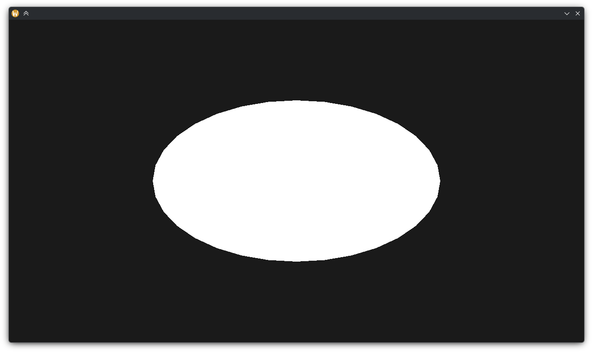
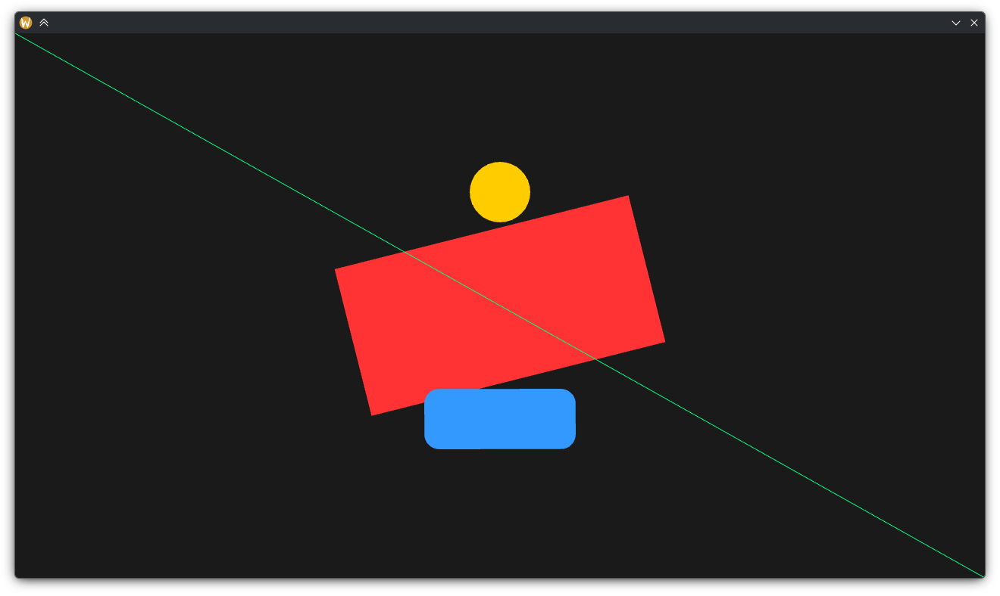
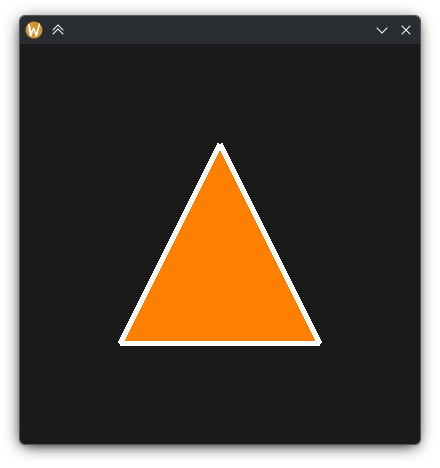
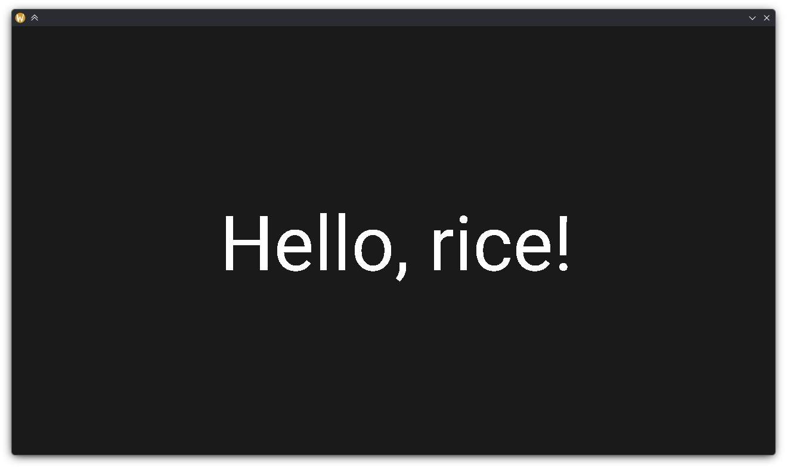
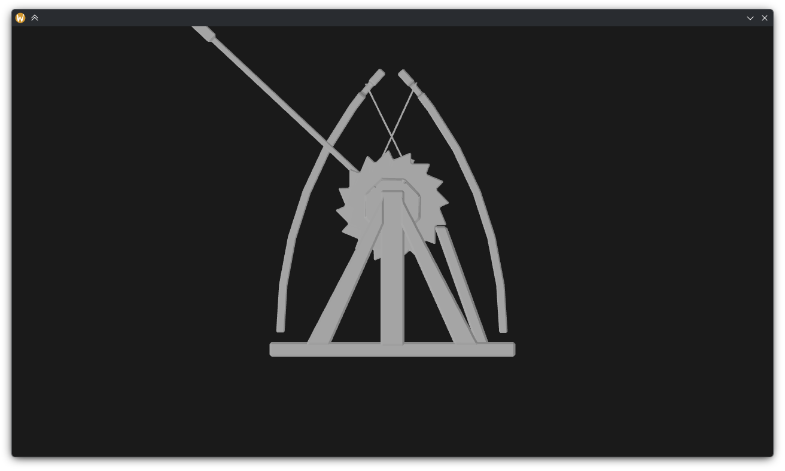
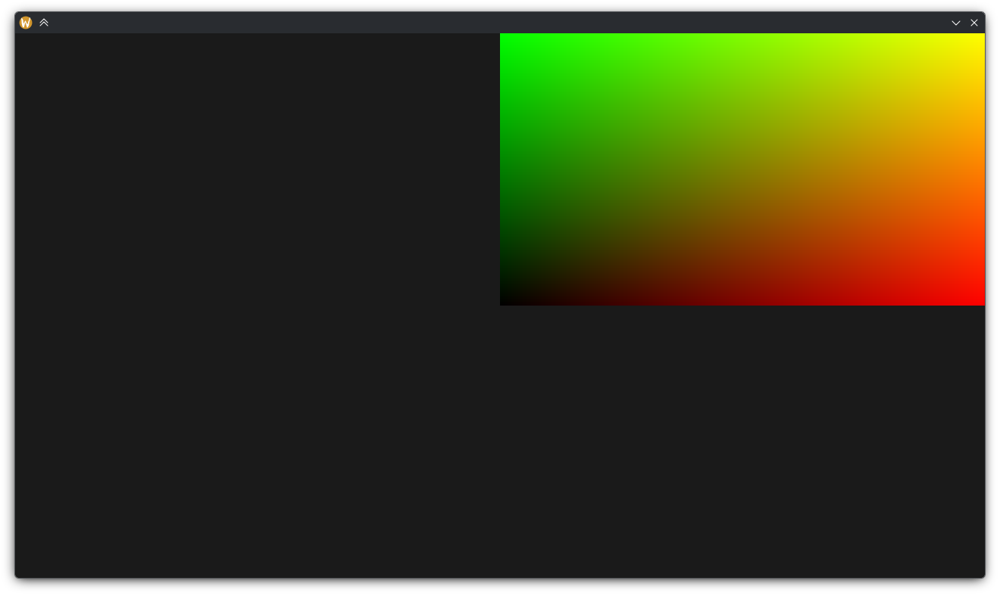

# Rice
Rice (from Russian "рис.", shortened form of "рисунок", drawing)

A GPU-accelerated 2D/3D rendering library for Nim, built on OpenGL.

Libraries to use with rice:
- [pixie](https://github.com/treeform/pixie) — path construction, image and font loading (used internally).
- [shady](https://github.com/treeform/shady) — Nim-to-GLSL shader transpiler (used internally).
- [siwin](https://github.com/levovix0/siwin) (or [windy](https://github.com/treeform/windy)) — window creation and event handling.
- [sigui](https://github.com/levovix0/sigui) — A gui framework that uses rice to render UI.


## Table of contents
1. [Examples](#Examples)
   * [Minimal](#Minimal)
   * [2D shapes](#2D-shapes)
   * [Paths](#Paths)
   * [Text](#Text)
   * [3D mesh](#3D-mesh)
   * [Custom shader](#Custom-shader)
2. [Features](#Features)
   * [Setup](#Setup)
   * [2D Primitives](#2D-Primitives)
   * [Paths and polygons](#Paths-and-polygons)
   * [Text rendering](#Text-rendering)
   * [3D rendering](#3D-rendering)
   * [Framebuffers and antialiasing](#Framebuffers-and-antialiasing)
   * [Custom shaders](#Custom-shaders)
   * [Transforms](#Transforms)
3. [Compile switches](#Compile-switches)
4. [Notes](#Notes)
4. [Why opengl?](#Why-opengl)


# Examples

## Minimal



```nim
import pkg/siwin
import rice

let win = newOpenglWindow()
opengl.loadExtensions()
let ctx = newDrawContext()

win.eventsHandler.onRender = proc(e: RenderEvent) =
  glViewport 0, 0, e.window.size.x.GlInt, e.window.size.y.GlInt
  ctx.updateDrawingAreaSize(e.window.size)
  glClearColor(0.1, 0.1, 0.1, 1)
  glClear(GL_COLOR_BUFFER_BIT)

  ctx.fillCircle(color(1, 1, 1), radius = 0.5)

run win
```

Without `ctx.viewport =` the default is identity (GL clip space, [-1..1] on both axes).


## 2D shapes



```nim
import std/times
import pkg/[bumpy, siwin]
import rice

let win = newOpenglWindow()
opengl.loadExtensions()
let ctx = newDrawContext()
var aafb = ctx.newAntialiasedFrameBuffer(win.size)
var time = 0'f32

win.eventsHandler.onResize = proc(e: ResizeEvent) =
  glViewport 0, 0, e.size.x.GlInt, e.size.y.GlInt
  ctx.resize(aafb, e.size)
  ctx.updateDrawingAreaSize(e.size)

win.eventsHandler.onRender = proc(e: RenderEvent) =
  ctx.drawInside aafb:
    glClearColor(0.1, 0.1, 0.1, 1)
    glClear(GL_COLOR_BUFFER_BIT)

    let (vw, vh) = (e.window.size.x.float32, e.window.size.y.float32)
    ctx.viewport = combine(
      scale(vec3(2 / vw, -2 / vh, 1)),
      translate(vec3(-1, 1, 0)),
    )

    var r = rect(vw/2 - 200, vh/2 - 100, 400, 200)
    ctx.fillRect(r, color(1, 0.2, 0.2),
      rotateZ(time / 4, origin = vec3(r.xy + r.wh/2, 0)))

    ctx.fillRoundRect(color(0.2, 0.6, 1), size = vec2(200, 80), radius = 20,
      center = vec3(vw/2, vh/2 + 150, 0))

    ctx.fillCircle(color(1, 0.8, 0), radius = 40,
      center = vec3(vw/2, vh/2 - 150, 0))

    ctx.drawLine(color(0, 1, 0.5), a = vec2(0, 0), b = vec2(vw, vh))

win.eventsHandler.onTick = proc(e: TickEvent) =
  time += e.deltaTime.inMicroseconds / 1_000_000
  redraw win

run win
```


## Paths



```nim
import pkg/[pixie, siwin]
import rice

let win = newOpenglWindow(size=ivec2(400, 400))
opengl.loadExtensions()
let ctx = newDrawContext()

var path = newPath()
path.moveTo(0, 0.5)
path.lineTo(0.5, -0.5)
path.lineTo(-0.5, -0.5)
path.closePath()

let fillMesh   = path.toMesh()
let strokeMesh = path.toStrokeMesh(strokeWidth = 0.025, lineCap = RoundCap, lineJoin = RoundJoin)

win.eventsHandler.onRender = proc(e: RenderEvent) =
  glViewport 0, 0, e.window.size.x.GlInt, e.window.size.y.GlInt
  ctx.updateDrawingAreaSize(e.window.size)
  glClearColor(0.1, 0.1, 0.1, 1)
  glClear(GL_COLOR_BUFFER_BIT)

  ctx.fill2dMeshFlat(fillMesh, color(1, 0.5, 0))
  ctx.fill2dMeshFlat(strokeMesh, color(1, 1, 1))

run win
```


## Text



```nim
import pkg/siwin
import pkg/pixie/fonts
import rice

let win = newOpenglWindow()
opengl.loadExtensions()
let ctx = newDrawContext()

let typeface = staticRead("font.ttf").static.parseTtf()
let font = newFont(typeface)
font.size = 128

let arrangement = font.typeset("Hello, rice!")

win.eventsHandler.onRender = proc(e: RenderEvent) =
  glViewport 0, 0, e.window.size.x.GlInt, e.window.size.y.GlInt
  ctx.updateDrawingAreaSize(e.window.size)
  glClearColor(0.1, 0.1, 0.1, 1)
  glClear(GL_COLOR_BUFFER_BIT)

  let (vw, vh) = (e.window.size.x.float32, e.window.size.y.float32)
  ctx.viewport = combine(
    scale(vec3(2 / vw, -2 / vh, 1)),
    translate(vec3(-1, 1, 0)),
  )

  ctx.drawText(
    pos = vec3(vw / 2, vh / 2, 0),
    arrangement = arrangement,
    color = vec4(1, 1, 1, 1),
    origin = vec2(0.5, 0.5),
  )

run win
```

draw text to AntialiasedFramebuffer or use rice/rasterTexts for antialiasing


## 3D mesh



```nim
import std/math
import pkg/siwin
import rice

let win = newOpenglWindow()
opengl.loadExtensions()
let ctx = newDrawContext()
var aafb = ctx.newAntialiasedFrameBuffer(win.size, depth = true)

let mesh = staticRead("model.stl").static.parseStlAscii(Mesh)

win.eventsHandler.onResize = proc(e: ResizeEvent) =
  glViewport 0, 0, e.size.x.GlInt, e.size.y.GlInt
  ctx.resize(aafb, e.size)
  ctx.updateDrawingAreaSize(e.size)

win.eventsHandler.onRender = proc(e: RenderEvent) =
  ctx.drawInside aafb:
    glClearColor(0.1, 0.1, 0.1, 1)
    glClearDepthf(1.0)
    glClear(GL_COLOR_BUFFER_BIT or GL_DEPTH_BUFFER_BIT)

    let (vw, vh) = (e.window.size.x.float32, e.window.size.y.float32)
    ctx.viewport = combine(
      scale(vec3(vh / vw, 1, 1/1000)),
    )

    ctx.withFaceCulling back:
      ctx.withPushPop depthTest:
        ctx.fill3dMeshShadedByNormalsSingleSide(
          mesh,
          lightDir = vec3(-0.5, -0.5, 1),
          transform = combine(
            rotateX(float32 Pi / 2),
            translate(vec3(0, -0.5, 0)),
          ),
        )

run win
```


## Custom shader



```nim
import pkg/siwin
import rice

let win = newOpenglWindow()
opengl.loadExtensions()
let ctx = newDrawContext()

win.eventsHandler.onRender = proc(e: RenderEvent) =
  glViewport 0, 0, e.window.size.x.GlInt, e.window.size.y.GlInt
  ctx.updateDrawingAreaSize(e.window.size)
  glClearColor(0.1, 0.1, 0.1, 1)
  glClear(GL_COLOR_BUFFER_BIT)

  let shader = ctx.makeShader:
    proc vert =
      var pos {.inp.}: Vec2
      var uv  {.out.}: Vec2
      gl_Position = vec4(pos.x, pos.y, 0, 1)
      uv = pos

    proc frag =
      var glColor {.outGl.}: Vec4
      glColor = vec4(uv.x, uv.y, 0, 1)

  useAndPassUniforms shader
  draw ctx.rect

run win
```

`ctx.rect` is a built-in unit quad (0..1 on both axes, two triangles). The shader above maps vertex position directly to clip space and outputs UV-based color.


# Features

## Setup

```nim
let ctx = newDrawContext()
```

Call on every resize (and on first render if size is not set up front):
```nim
glViewport 0, 0, size.x.GlInt, size.y.GlInt
ctx.updateDrawingAreaSize(size)
```

Setting a 2D viewport (pixel coordinates, y-down, origin at top-left):
```nim
let (vw, vh) = (width.float32, height.float32)
ctx.viewport = combine(
  scale(vec3(2 / vw, -2 / vh, 1)),
  translate(vec3(-1, 1, 0)),
)
```

Setting `ctx.viewport` and/or `ctx.projection` automatically updates `ctx.viewportToGlMatrix` and `ctx.glToViewportMatrix`, which are used internally by all drawing procs.

Projection matrix is applied after viewport matrix. Use viewport for `world -> camera` transformations and projection for `camera -> opengl space` transformations

For 3D, build a camera matrix and assign it as viewport:
```nim
ctx.viewport = combine(
  translate(cameraPos),
  cameraRot,
  scale(vec3(zoom)),
  scale(vec3(height / width, 1, 1/farPlane)),
)
```

Useful fields:
```nim
ctx.px: Vec2   # size of one pixel in GL clip units (2/w, 2/h)
ctx.wh: Vec2   # half-size of the drawing area in pixels
```


## 2D Primitives

All procs accept an optional `transform: Mat4` applied before the viewport transform.

```nim
# filled rectangle
ctx.fillRect(rect(x, y, w, h), color(1, 0.2, 0.2))
ctx.fillRect(rect(x, y, w, h), color(1, 0.2, 0.2), rotateZ(angle, origin))

# filled rectangle with explicit 3D placement
ctx.fillRect(color(1, 0, 0), size = vec2(100, 50), center = vec3(200, 150, 0))
ctx.fillRect(color(1, 0, 0), size = vec2(100, 50), center = vec3(0), normal = vec3(1, 0, 0))

# outlined rectangle
ctx.drawRect(color(1, 0, 0), size = vec2(100, 50))

# filled rounded rectangle
ctx.fillRoundRect(color(0.2, 0.6, 1), size = vec2(200, 80), radius = 20)
ctx.fillRoundRect(color(0.2, 0.6, 1), size = vec2(200, 80),
  tl = 20, tr = 20, bl = 5, br = 5)  # per-corner radii

# outlined rounded rectangle
ctx.drawRoundRect(color(0.2, 0.6, 1), size = vec2(200, 80), radius = 20)

# filled circle
ctx.fillCircle(color(1, 0.8, 0), radius = 50)
ctx.fillCircle(color(1, 0.8, 0), radius = 50, center = vec3(300, 200, 0))

# outlined circle
ctx.drawCircle(color(1, 0.8, 0), radius = 50)

# line (1px thick, GL_LINES)
ctx.drawLine(color(0, 1, 0), a = vec2(0, 0), b = vec2(400, 300))

# thick line (triangle strip)
ctx.drawLine(color(0, 1, 0), thickness = 3.0,
  a = vec3(0, 0, 0), b = vec3(400, 300, 0), normal = vec3(0, 0, 1))
```


## Paths and polygons

`Path` objects come from [pixie](https://github.com/treeform/pixie). Rice converts them to GPU triangle meshes.

High-level — triangulate and draw in one call:
```nim
import pkg/pixie

var path = newPath()
path.moveTo(100, 100)
path.cubicTo(150, 50, 250, 150, 300, 100)
path.closePath()

ctx.fillPath(path, color(1, 0.5, 0))
ctx.strokePath(path, color(1, 1, 1), strokeWidth = 2.0,
  lineCap = RoundCap, lineJoin = RoundJoin)
```

Pre-triangulate to reuse the mesh across frames:
```nim
let fillMesh   = path.toMesh()
let strokeMesh = path.toStrokeMesh(
  strokeWidth = 2.0, lineCap = RoundCap, lineJoin = MiterJoin)

# per frame:
ctx.fill2dMeshFlat(fillMesh, color(1, 0.5, 0))
ctx.fill2dMeshFlat(strokeMesh, color(1, 1, 1))
```

`toMesh` uses the Bayazit triangulation algorithm and handles holes via `removeHoles` (bridges them into outer contours).

Draw multiple meshes with the same color:
```nim
for mesh in meshes:
  ctx.fill2dMeshFlat(mesh, color(1, 0.5, 0))
```


## Text rendering

High-level: arrange once, draw every frame.
```nim
import pkg/pixie/fonts

let typeface = staticRead("font.ttf").parseTtf()
let font = newFont(typeface)
font.size = 24

let arrangement = font.typeset("Hello world",
  hAlign = CenterAlign, bounds = vec2(400, 100))

# in onRender:
ctx.drawText(
  pos = vec3(200, 100, 0),   # top-left position in viewport (pixel) space
  arrangement = arrangement,
  color = vec4(1, 1, 1, 1),
  origin = vec2(0.5, 0),     # (0,0) = top-left anchor, (0.5,0) = center-top
)
```

Low-level: draw glyph by glyph with a shared context (useful for mixing colors or sizes).
```nim
var tdctx = ctx.startTextDrawing(font)
tdctx.color.uniform = vec4(1, 1, 1, 1)

for i, rune in arrangement.runes:
  ctx.fastDrawRune(rune, arrangement.selectionRects[i], tdctx)

ctx.endTextDrawing()
```

Text glyphs are triangulated from font outlines via pixie and cached per typeface in `ctx.glyphMeshes`.


## 3D rendering

Load a mesh from an STL file (ASCII format):
```nim
let mesh = staticRead("model.stl").static.parseStlAscii(Mesh)
```

Flat shading (uniform color, no lighting):
```nim
ctx.fill3dMeshFlat(mesh, color(0.3, 0.79, 1),
  transform = rotateX(float32 Pi / 2))
```

Shading by vertex normals (single-sided Phong-like):
```nim
ctx.fill3dMeshShadedByNormalsSingleSide(
  mesh,
  color       = color(0.3, 0.79, 1),
  shadowColor = color(0.4, 0.4, 0.4),
  lightDir    = vec3(-0.5, -0.5, 1),
  backlight   = 0.6,
  transform   = combine(
    rotateX(float32 Pi / 2),
    translate(vec3(0, -0.5, 0)),
  ),
)
```

Face culling and depth testing:
```nim
ctx.withFaceCulling back:        # cull back faces
  ctx.withPushPop depthTest:     # enable depth test
    ctx.fill3dMeshFlat(mesh, color(0.3, 0.79, 1))
```

`withFaceCulling` takes `front` or `back` and an optional winding order (default `ccw`).


## Framebuffers and antialiasing

The simplest way to render with MSAA antialiasing:
```nim
var aafb = ctx.newAntialiasedFrameBuffer(win.size)

win.eventsHandler.onResize = proc(e: ResizeEvent) =
  glViewport 0, 0, e.size.x.GlInt, e.size.y.GlInt
  ctx.resize(aafb, e.size)
  ctx.updateDrawingAreaSize(e.size)

win.eventsHandler.onRender = proc(e: RenderEvent) =
  ctx.drawInside aafb:
    glClearColor(0.1, 0.1, 0.1, 1)
    glClear(GL_COLOR_BUFFER_BIT)
    # ... all drawing here ...
```

`drawInside` renders into the MSAA buffer and blits the resolved result to the screen.

With depth buffer (for 3D):
```nim
var aafb = ctx.newAntialiasedFrameBuffer(win.size, depth = true)
# inside drawInside:
glClearDepthf(1.0)
glClear(GL_COLOR_BUFFER_BIT or GL_DEPTH_BUFFER_BIT)
```

Temporary framebuffers (pooled):
```nim
let fb = ctx.requireFrameBuffer(ivec2(512, 512))
let pushed = ctx.push(fb)
# draw into fb ...
ctx.pop(pushed)
ctx.free(fb)  # return to pool for reuse
```


## Custom shaders

Shaders are written as Nim procs and transpiled to GLSL via [shady](https://github.com/treeform/shady). The `makeShader` macro compiles each shader once per call site and caches it in `ctx.shaders`.

```nim
let shader = ctx.makeShader:
  proc vert =
    ...
  proc frag =
    ...
```

### Variable pragmas

| pragma | stage | meaning |
|--------|-------|---------|
| `{.inp.}` | vert | vertex attribute (input from mesh) |
| `{.out.}` | vert | varying: written in vert, readable in frag |
| `{.outGl.}` | frag | fragment output (gl_FragColor) |

```nim
let shader = ctx.makeShader:
  proc vert =
    var pos {.inp.}: Vec2   # read from vertex buffer
    var uv  {.out.}: Vec2   # passed to fragment shader
    gl_Position = vec4(pos, 0, 1)
    uv = pos

  proc frag =
    # uv is automatically available (declared {.out.} in vert)
    var color {.outGl.}: Vec4
    color = vec4(uv.x, uv.y, 0, 1)

useAndPassUniforms shader
draw ctx.rect
```

### Uniforms via named parameters

Declare `Uniform[T]` parameters in the proc signature. Set them on the returned shader object and activate manually:

```nim
let shader = ctx.makeShader:
  proc vert(transform: Uniform[Mat4]) =
    var ipos {.inp.}: Vec2
    gl_Position = transform * vec4(ipos, 0, 1)

  proc frag(color: Uniform[Vec4]) =
    var glCol {.outGl.}: Vec4
    glCol = color

use shader.shader
shader.transform.uniform = ctx.viewportToGlMatrix * myTransform
shader.color.uniform = vec4(1, 0.5, 0, 1)
draw ctx.rect
```

### Uniforms via value capture

Use `@(expr)` to capture a Nim value directly inside the shader body. Captured values are automatically uploaded when you call `useAndPassUniforms`:

```nim
let myColor = color(1, 0.2, 0.2)
let numPoints = 256

let shader = ctx.makeShader:
  proc vert =
    var t {.out.}: float32
    t = gl_VertexID.float32 / @(numPoints.float32)
    gl_Position = vec4(t * 2 - 1, sin(t * 2 * Pi), 0, 1)

  proc frag =
    var glCol {.outGl.}: Vec4
    glCol = @(myColor.vec4)

useAndPassUniforms shader          # use + upload all @() values
glDrawArrays(GL_LINE_STRIP, 0, numPoints)
```

`useAndPassUniforms` is a template generated by the macro. It calls `use shader.shader` and uploads every captured `@()` value as a uniform.

### Compile-time GLSL insertion

`typ@!("glsl_expr")` inserts a raw GLSL string into the generated shader at compile time, with `typ` providing the Nim type for the placeholder:

```nim
proc frag =
  var glCol {.outGl.}: Vec4
  glCol = vec4(float32@!("atan(t, 1.0 - t)"), 0, 0, 1)
```

### Built-in meshes and draw targets

```nim
draw ctx.rect    # unit quad: positions in [-1..1] x [-1..1], two triangles
draw ctx.line    # single GL_LINES line from 0 to 1
glDrawArrays(GL_LINE_STRIP, 0, n)  # draw n vertices without a mesh, use gl_VertexID in vertex shader to determine vertex position
```

### Debugging

Compile with `-d:rice_debugShaders` to print the generated GLSL to stdout at compile time.


## Transforms

`combine` multiplies transforms left-to-right (first transform applied first):

```nim
let m = combine(
  translate(vec3(100, 200, 0)),
  rotateZ(Pi / 4, origin = vec3(100, 200, 0)),
  scale(vec3(2, 2, 1)),
)
```

Available transforms:

```nim
translate(x, y, z: float32): Mat4
scale(x, y, z: float32): Mat4

# rotate around point
rotateX(angle: float32, origin: Vec3): Mat4
rotateY(angle: float32, origin: Vec3): Mat4
rotateZ(angle: float32, origin: Vec3): Mat4

# from vmath
translate(v: Vec3): Mat4
scale(v: Vec3): Mat4

rotateX(angle: float32): Mat4
rotateY(angle: float32): Mat4
rotateZ(angle: float32): Mat4
```

Coordinate system helpers from `DrawContext`:
```nim
ctx.viewportToGlMatrix
ctx.glToViewportMatrix  # inverse of the above
```

These are set automatically when you assign `ctx.viewport =` and/or `ctx.projection =`.


# Compile switches

```nim
const rice_max_opengl_error_len {.intdefine.} = 512
```
Maximum length of OpenGL error messages. Increase if error strings appear truncated.

```nim
const rice_glyphBuffer_textureSize {.intdefine.} = 1024
```
Size of the glyph atlas texture (raster text backend). Increase for large fonts or many glyphs.

```nim
const rice_render_texturesToAllocateIfNoFree {.intdefine.} = 8
```
Number of textures to pre-allocate in the texture pool when none are free.


# Notes

Rice is a work in progress. API is very unstable.

- Shady transpiles Nim procs to GLSL at compile time. This makes compilation slower than when using GLSL strings. Nim's IC would help significantly.
- pixie (required for path triangulation and font loading) brings roughly 300 MB of transitive dependencies if installed via `atlas`.

## Why OpenGL?

It is available almost everywhere and is stable.

Some time in the future Vulkan backend may be implemented.
